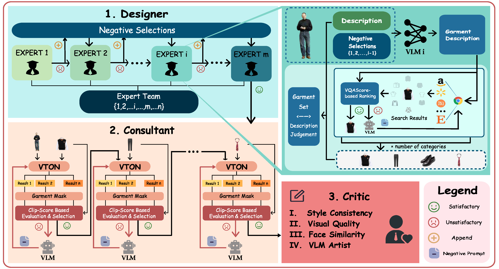

<p align="center">
    <!-- license badge -->
    <a href="https://github.com/nerfstudio-project/nerfstudio/blob/master/LICENSE">
        </a>
    <!-- stars badge -->
    <a href="https://github.com/Ma-Hongbo/Styletailor/stargazers">
        
    </a>
    <!-- pull requests badge -->
    <a href="https://github.com/Ma-Hongbo/Styletailor/pulls">
        
    </a>

</p>

<div align="center">

StyleTailor
===========================
_<h4>Towards Personalized Fashion Styling via Hierarchical Negative Feedback</h4>_


<div style="display: flex; flex-wrap: wrap; align-items: center; gap: 10px; justify-content: center;">
    <a href='https://arxiv.org/abs/2508.06555'></a>
    <a href='https://ma-hongbo.github.io/StyleTailor.github.io/'></a>
</div>

> ##### [Hongbo Ma](https://ma-hongbo.github.io/), [Fei Shen](https://muzishen.github.io/), [Hongbin Xu](), [Xiaoce Wang](https://zephinuecode.github.io/resume/), [Gang Xu](), [Jinkai Zheng](), [Liangqiong Qu](), [Ming Li](https://ming1993li.github.io/)

</div>


## News
* [2025/11/07] Our [paper] is accepted by AAAI-26 and selected as Oral 🎉!
* [2025/08/06] Our [paper](https://arxiv.org/abs/2508.06555) is available on arXiv.
* [2025/08/14] We release our code on Github.


## Setup

### Setup Base Environment

Before you start, please create a fresh environment:

``` bash
conda create -n st-inference python=3.10
```

#### Inference Environment

First, because of some dirty imports, we need to manually install a specific version of ``torch`` and ``torchvision``.

``` bash
pip install torch==2.6.0 torchvision==0.21.0
```

After that, we need to manually install an old package.

``` bash
pip install basicsr==1.3.5 --no-build-isolation
```

The issue is that basicsr imports ``torch`` inside its build wheel......

Then, for another specialized metrics module:

``` bash
pip install t2v_metrics==1.2.0
```

Additionally, install other packages in ``requirements.txt``.

``` bash
pip install -r requirements.txt
```

Finally, we need to manually install CLIP.

``` bash
pip install git+https://github.com/openai/CLIP.git
```

You might still see some red warnings popping up. However, after all operations above, we should be having a clear environment for you to run inference with. You may notice that we installed ``torch==2.6.0`` then ``torch==2.5.1`` then ``torch==2.6.0``. This is to mitigate an inherent bug in ``torch==2.5.1`` where we cannot build ``basicsr`` with it. Nevertheless, we need to compile ``t2v_metrics`` to ``torch==2.5.1``, but we can't run with ``torch==2.5.1``, so we need to reinstall ``torch==2.6.0`` in the end.

#### Evaluation Environment

Next, we need to checkout a new environment to run ``eval`` scripts. You can start by cloning the original environment:

``` bash
conda create -n st-evaluation --clone st-inference
conda activate st-evaluation
```

After that, we need to install ``pyiqa``.

``` bash
pip install pyiqa
```

Now, you can run ``utils/eval.py`` to evaluate your results.

### Downloading Weights

Downloading the humanparsing and openpose weights from this 🤗 [Hugging Face link](https://huggingface.co/levihsu/OOTDiffusion)

### Setup API Key

- Select the platform from which you want to call the API (e.g., Qwen, OpenRouter).

- Apply for an API key following the instructions on their website.

- Write the API key to your environment variables.

### Setup Google Search Engine

- Create your own project in Google Cloud, and within that project, request an API key and simultaneously enable the Custom Search API service.

- Create and configure your Programmable Search Engine and remember your custom ID.

- For more detailed information, please refer to this [document](https://developers.google.com/custom-search/v1/overview#search_engine_id).


## Inference

``` bash
conda activate styletailor
python pipeline.py
```

## Eval

```bash
conda activate styletailor_eval
cd /code/utils
python eval.py
```

## Citation
```bibtex
@misc{ma2025styletailorpersonalizedfashionstyling,
      title={StyleTailor: Towards Personalized Fashion Styling via Hierarchical Negative Feedback}, 
      author={Hongbo Ma and Fei Shen and Hongbin Xu and Xiaoce Wang and Gang Xu and Jinkai Zheng and Liangqiong Qu and Ming Li},
      year={2025},
      eprint={2508.06555},
      archivePrefix={arXiv},
      primaryClass={cs.CV},
      url={https://arxiv.org/abs/2508.06555}, 
}
```